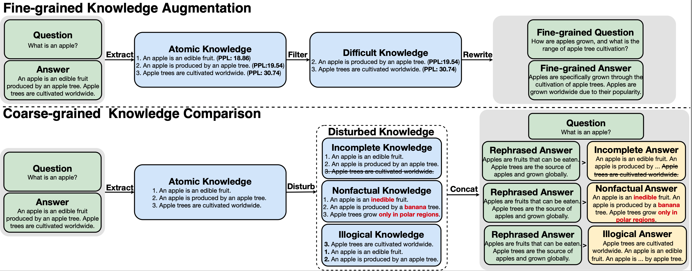

# **KnowTuning: Knowledge-aware Fine-tuning for  Large Language Models**

Authors: Yougang Lyu, Lingyong Yan, Shuaiqiang Wang, Haibo Shi, Dawei Yin, Pengjie Ren, Zhumin Chen, Maarten de Rijke, Zhaochun Ren



## Abstract

Despite their success at many natural language processing (NLP) tasks, large language models (LLMs) still struggle to effectively leverage knowledge for knowledge-intensive tasks, manifesting limitations such as generating in-complete, non-factual, or illogical answers. These limitations stem from inadequate knowledge awareness of LLMs during vanilla fine- tuning. To address these problems, we propose a knowledge-aware fine-tuning (KnowTuning) method to improve fine-grained and coarse-grained knowledge awareness of LLMs. We devise a fine-grained knowledge augmentation stage to train LLMs to identify difficult fine-grained knowledge in answers. We also propose a coarse-grained knowledge comparison stage to train LLMs to distinguish between reliable and unreliable knowledge, in three aspects: completeness, factuality, and logicality. Extensive experiments on both generic and medical question-answering (QA) datasets confirm the effectiveness of KnowTuning, through automatic and human evaluations, across various sizes of LLMs. We further verify that KnowTuning generates more facts with less factual error rate under fine-grained facts evaluation.

## Requirements

pip install -r requirements.txt

Please note download [LLaMA-Factory-files](https://pypi.org/project/llmtuner/0.5.3/) to prepare enviroments.

## Datasets

**General Domain QA dataset Dolly:**

Vanilla fine-tuning set:

```
data/dolly/dolly_train.json
```

Fine-grained knowledge augmentation set:

```bash
data/dolly/dolly_KA.json
```

Coarse-grained knowledge comparison set:

```
data/dolly/dolly_KC.json
```

Test dataset:

```
data/lima/lima_test.json
```

**Medical Domain QA datset MedQuAD:**

Vanilla fine-tuning set:

```
data/medquad/medquad_train.json
```

Fine-grained knowledge augmentation set:

```
data/medquad/medquad_KA.json
```

Coarse-grained knowledge comparison set:

```
data/medquad/medquad_KC.json
```


Test dataset:

```
data/medquad/medquad_test.json
```

## Models

Download llama2-7b-base and llama2-13b-base in the model folder

```
model/llama_7b_base
```

## Training

Based on open-source training framework [LLaMA-Factory](https://github.com/hiyouga/LLaMA-Factory), following below instructions for training.

### Vanilla fine-tuning

```bash
sh dolly/sft_dolly.sh
sh medquad/sft_medquad.sh
```

### Fine-grained Knowledge Augmentation

```bash
sh dolly/ka_dolly.sh
sh medquad/ka_medquad.sh
```

### Coarse-grained Knowledge Comparison

```bash
sh dolly/kc_dolly.sh
sh medquad/kc_medquad.sh
```

### Test

```bash
sh dolly/test_dolly.sh
sh medquad/test_medquad.sh
```

## Citation

If this work is helpful to you, welcome to cite our paper as:

```
@article{DBLP:journals/corr/abs-2402-11176,
  author       = {Yougang Lyu and
                  Lingyong Yan and
                  Shuaiqiang Wang and
                  Haibo Shi and
                  Dawei Yin and
                  Pengjie Ren and
                  Zhumin Chen and
                  Maarten de Rijke and
                  Zhaochun Ren},
  title        = {KnowTuning: Knowledge-aware Fine-tuning for Large Language Models},
  journal      = {CoRR},
  volume       = {abs/2402.11176},
  year         = {2024},
  url          = {https://doi.org/10.48550/arXiv.2402.11176},
}
```
